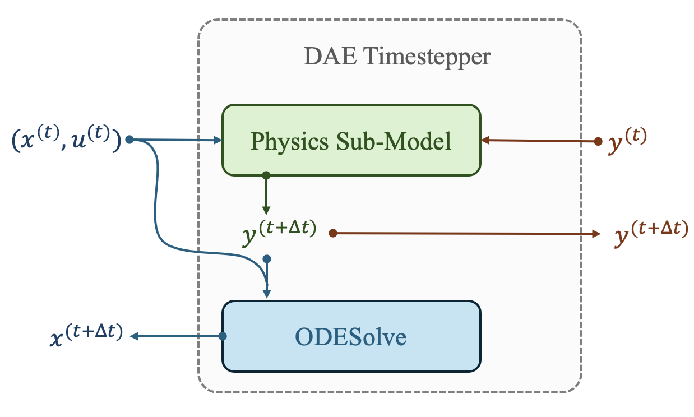

# Neural Differential Algebraic Equations


This is the repository for the paper titled **[Learning Neural Differential Algebraic Equations via Operator Splitting](https://arxiv.org/abs/2403.12938)** by James Koch, Madelyn Shapiro, Himanshu Sharma, Draguna Vrabie, and Jan Drgona.

Neural Differential Algebraic Equations (Neural DAEs) are an extension of the canonical neural timestepper for systems with algebraic constraints. 
Inspired by fractional-step methods, this work leverages sequential sub-tasks to provide updates for algebraic states and differential states.

<p align="center">
    
</p>


**Simple tutorial example in Neuromancer** 
+ [Tank-Manifold example using basic Neuromancer abstractions](https://github.com/pnnl/NeuralDAEs/blob/master/training/train_manifold_simple.py)

**Training and visualization scripts needed for reproducing all paper results**
+ [Neuromancer 1.4 with custom modules for DAE integration](https://github.com/pnnl/NeuralDAEs/tree/master/neuromancer-dae)
+ [Tank-Manifold Property Inference Example](https://github.com/pnnl/NeuralDAEs/blob/master/training/train_manifold.py)
+ [Tank Network Modeling Example](https://github.com/pnnl/NeuralDAEs/blob/master/training/train_network.py)

## Cite as
```yaml
@inproceedings{koch2025,
      title={Learning Neural Differential Algebraic Equations via Operator Splitting}, 
      author={James Koch and Madelyn Shapiro and Himanshu Sharma and Draguna Vrabie and Jan Drgona},
      year={2025},
      eprint={2403.12938},
      archivePrefix={arXiv},
      primaryClass={cs.LG},
      url={https://arxiv.org/abs/2403.12938}, 
      volume={},
      number={},
      booktitle={Conference on Decision and Control (CDC)}, 
}
```


## Acknowledgments

This research was supported by the U.S. Department of Energy through the Building Technologies Office under the Advancing Market-Ready Building Energy Management by Cost-Effective Differentiable Predictive Control projects. PNNL is a multi-program national laboratory operated for the U.S. Department of Energy (DOE) by Battelle Memorial Institute under Contract No. DE-AC05-76RL0-1830.

<p align="center">
    
</p>


This research was also supported by the Ralph O’Connor Sustainable Energy Institute at Johns Hopkins University.

<p align="center">
    
</p>


